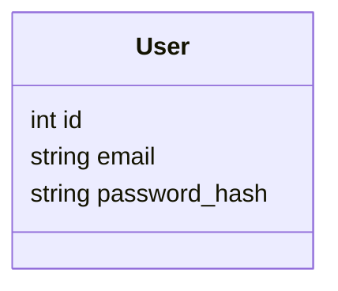

# Architecture

## Overview
There are now two ways to use this app, both backed by the same Flask process:

1. **The original server-rendered pages** (`templates/`) - Flask does everything,
   HTML included. Still works standalone at `http://localhost:5000`.
2. **A Next.js frontend** (`frontend/`) - the primary UI now. It's a plain React
   app that calls Flask's JSON API (`api.py`) over HTTP; Flask still owns every
   bit of real logic (login, the shop API client, the AI agent). This split exists
   because the frontend needed to be deployable somewhere Next.js-friendly (e.g.
   Vercel) - see "The frontend/backend split" below.

The catalogue, balance, and orders are **not** stored locally either way - Flask
fetches them live from the real Day 1 furniture shop API on every request. The only
thing SQLite holds is our own login accounts, because the shop API only has one real
account for this whole exercise, and our app wants multiple demo logins.

```
 Next.js (frontend/, :3000)  <--fetch, credentials: include-->  Flask (app.py + api.py, :5000)
 Browser  <--HTTP, templates/-->                                     |    \
                                                                      |     <--HTTPS--> Azure OpenAI (agent.py)
                                                          <--reads/writes--> SQLite (login accounts only)
                                                                      |
                                                                      <--HTTPS--> Furniture shop API (shop_api.py)
```

1. The browser (via Next.js, or directly) requests a page.
2. Flask checks if the user is logged in (via a session cookie) using `db.py`
   (SQLite) — this part is entirely local.
3. Flask calls `shop_api.py`, which makes a real HTTPS request to the furniture
   shop API for whatever's needed (catalogue, balance, order history).
4. **Server-rendered path:** Flask fills in a Jinja2 template in `templates/` and
   sends the finished HTML page back. **Next.js path:** Flask's `api.py` route
   returns the same data as JSON instead; the React page in `frontend/` renders it.
5. When the buyer buys something, the browser (either path) triggers a real
   `shop_api.place_order(...)` call — a real order, debiting the real balance.
6. On the assistant page (either path), the buyer's typed message goes to
   `agent.py`, which asks Azure OpenAI what to do. The model calls back into the
   *same* `shop_api.py` functions as tools (never a separate code path) - see
   "The AI assistant" below.

## The frontend/backend split
`frontend/` is a Next.js (TypeScript, App Router) app. It owns **no** business
logic - no shop API calls, no Azure OpenAI calls, no SQLite. Every page is a
client component ("use client") that calls Flask's JSON API and renders what
comes back:

- `src/lib/api.ts` - a typed fetch wrapper for every `/api/*` endpoint. Reads the
  backend's URL from `NEXT_PUBLIC_API_BASE_URL` (`.env.local`), not hardcoded, so
  it can point at a deployed backend later.
- `src/lib/AuthContext.tsx` - calls `/api/me` once on load and shares
  `{email, balance}` app-wide via React context, so every page/the header agree
  on auth state without each fetching it separately.
- `src/lib/useRequireAuth.ts` - redirects to `/login` once we know for sure the
  user isn't authenticated (mirrors `if user is None: return redirect(...)` in
  the Flask routes).
- `src/lib/formatReply.tsx` - the AI assistant's bullet-style replies rendered as
  a real `<ul><li>`, same logic as `app.py`'s `format_agent_reply` Jinja filter,
  ported to React (React escapes text content by default, so no manual escaping
  is needed here the way `app.py`'s version needs `markupsafe.escape`).

**Why a separate `api.py` instead of just adding `@app.route("/api/...")` to
app.py directly:** it's really about *where* the routes get registered, not
which file they live in. The routes in `api.py` are added via a
`register_api_routes(app, current_user, shop_user_id)` function that `app.py`
calls explicitly - `api.py` itself never imports `app.py`. That avoids a real bug
hit during development: `python app.py` runs the file as `__main__`, so a stray
`from app import app` inside a module Flask imports would make Python import
app.py a *second* time as a distinct `app` module, creating a second, unused
Flask instance that the new routes would register on instead of the one actually
being served.

**Cross-origin session cookies:** the Next.js dev server (`:3000`) and Flask
(`:5000`) are different origins, so `app.py` adds CORS via `flask-cors`
(`supports_credentials=True`, origin from `FRONTEND_ORIGIN` in `.env`, default
`http://localhost:3000`). Every frontend fetch call passes
`credentials: "include"` so the session cookie travels both ways. Because both
origins are `localhost` (just different ports), this is a same-site request, so
the cookie's default `SameSite=Lax` works without needing `SameSite=None` +
HTTPS - verified directly: a login POST from an `Origin: http://localhost:3000`
header returns `Access-Control-Allow-Origin: http://localhost:3000`,
`Access-Control-Allow-Credentials: true`, and a `Set-Cookie`; a follow-up
`/api/catalogue` call with that cookie succeeds.

**Deploying later:** the frontend can deploy to Vercel (or similar) on its own by
setting `NEXT_PUBLIC_API_BASE_URL` to wherever the Flask backend ends up running
(it needs a host that can keep a Python process alive - Vercel's serverless model
doesn't fit `furniture.db` or a long-lived session store well, so Flask likely
wants a small always-on host like Render/Railway/Fly.io instead). Update
`FRONTEND_ORIGIN` on the Flask side to match the deployed frontend's real URL.

## Why this stack
- **Flask** — a minimal Python web framework. It's a small, well-documented layer
  over "handle this URL, run this function, return this HTML" — easy to reason
  about without needing to understand a large framework. Also perfectly happy to
  return JSON instead of HTML, which is all `api.py` asks of it.
- **Next.js** — chosen specifically to be deployable on Next.js-friendly hosting.
  Plain React function components, no server actions/server components fetching
  data (everything client-side calls the Flask API) - kept deliberately simple
  rather than leaning on framework features that would blur the "Flask owns the
  logic" boundary.
- **SQLite** — used only for our own login accounts (`furniture.db`, one file, no
  server to install). Everything else is live data from the shop API, so there's
  nothing else to keep in sync.
- **`requests`** — the standard Python library for making HTTP calls; used in
  `shop_api.py` to talk to the furniture shop API.
- **Azure OpenAI (`openai` package)** — powers the "Ask the assistant" page.
  `agent.py` gives it four tools that call straight into `shop_api.py` — the
  model never talks to the shop API directly.
- **Jinja2 templates** — the original HTML files with small `{{ variable }}`
  placeholders. No build step, no JavaScript framework — still work standalone.
- **Session cookie login** — Flask has built-in support for signed session
  cookies. Login just means: check the password, then store the user's id in
  the session. No external auth service or library needed for a demo with a
  couple of test accounts.

## The furniture shop API
Base URL: `https://day1.training.cognitivo.com.au` (hardcoded in `shop_api.py` —
it's not a secret, only the credentials below are).

| What we need | Endpoint | Notes |
|---|---|---|
| Browse the catalogue | `GET /catalogue/search-index` | Fast, no images — `item_id`, `product_name`, `category`, `price`. Deliberately **not** `/catalogue`, which also returns images and is much slower. |
| Real balance | `GET /users/{user_id}` | Returns `{user_id, name, balance}`. |
| Place a real order | `POST /orders` | Body: `{"user_id", "items": [{"item_id", "quantity"}]}`. This is also the payment — it debits the balance. |
| Order history | `GET /orders/{user_id}` | Past orders for this account. |

Auth: every request sends an `X-Api-Key` header, read from the `API_KEY` environment
variable (`.env`, gitignored — never hardcoded or committed).

**One account for everyone**: the shop API only knows about a single `user_id`
(`SHOP_USER_ID` in `.env`) for this whole training exercise. Every demo login in our
app (alice@, bob@) acts through that same account — they'll see the same balance and
order history as each other, because underneath it's the same real account.

### Error handling
`shop_api.py` turns HTTP responses into typed exceptions instead of raw status codes,
so `app.py` can catch them and show a friendly message without crashing:

```
POST /orders response       shop_api.py raises              app.py shows
200 OK                      (returns the result)            "Order placed! ..."
404 Not Found                ProductNotFoundError            "This item is no longer available."
402 Payment Required         InsufficientBalanceError         "Insufficient balance for this order."
network error / other        ShopApiError                     a clear message with the detail
```

Every route that calls `shop_api.py` wraps the call in a `try`/`except` for these
exceptions — a shop API failure never produces a raw Flask error page.

## The AI assistant
The "Ask the assistant" page (`/assistant`) lets a logged-in buyer type a plain-English
request. `agent.py` sends it to Azure OpenAI along with four tools, each a thin wrapper
around a `shop_api.py` function:

| Tool | Calls | What it can't do |
|---|---|---|
| `search_catalogue` | `get_catalogue(category)` | Only an exact category match, server-side — no price, colour, or "vibe" filtering. |
| `get_product` | `get_product(item_id)` | Needs an exact `item_id` — not for searching. |
| `check_balance` | `get_balance(user_id)` | One shared account — same answer no matter who's logged into our app. |
| `propose_order` | `get_product(item_id)` (price lookup) | Doesn't charge anything — describes what buying would cost. |
| `confirm_and_place_order` | `place_order(...)` | Real, immediate charge, no undo. Only acts on a proposal from an *earlier* message. |

**Reasoning happens in the model, not the API.** Since `search_catalogue` can only
filter by an exact category, the system prompt tells the model: for anything like
"cheap" or a colour, call the tool (optionally with a category), then sort/filter/pick
from the plain JSON it gets back using its own judgement — never assume the API
understood the request. This was borne out in testing: asked for a "black bar stool",
the model first tried `category="Bar stools"` (a guess), got 0 results, then retried
with no category filter and picked out the black ones itself from the full list.

**Buying is two steps, spanning two real messages.** `propose_order` looks up the
price and describes the purchase without charging anything; only
`confirm_and_place_order` actually charges the balance, and it's only allowed to act
on a proposal that already existed when the *current* request started - not one made
moments earlier in the same reply. `agent.ask(user_message, shop_user_id,
pending_purchase)` takes whatever the previous call returned as `pending_purchase`
and fixes it as `state["confirmable"]` for the whole request; `propose_order` can only
update `state["to_persist"]` (what gets returned for the *next* call), never
`confirmable`. So even a single message that both asks to buy and says "yes, confirm,
do it now" gets the proposal but not the charge — confirmed in testing against a
deliberately adversarial prompt trying exactly that. `app.py` stores `pending_purchase`
in the session between requests (see `/assistant` below).

**A dropped connection can't cause a double-charge.** Each proposal gets one
`idempotency_key` (generated once, when `propose_order` runs), not a fresh one per
confirm attempt. This matters because a network timeout doesn't mean the order
failed — it means we don't know. This actually happened during testing: a
`confirm_and_place_order` call timed out on our end, but the balance had already
moved on the shop's side. Because the proposal (and its key) stayed pending across
the failed attempt, confirming again would have safely returned the original result
instead of placing a second order — the shop API's `Idempotency-Key` contract exists
for exactly this. The error shown to the user in that case says it's uncertain
whether the order went through, rather than confidently claiming nothing happened.

**Tool errors become the model's problem, not a crash.** `agent.py`'s `_run_tool`
catches `shop_api.ShopApiError` (and subclasses) and hands the model a plain
`{"error": "..."}` instead of raising - so a missing item or insufficient balance
becomes a normal, friendly reply ("that item's gone", "not enough balance") composed
by the model itself. A failure to reach Azure OpenAI at all (bad config, outage) is a
separate `agent.AgentError`, caught in `app.py` the same way `shop_api.ShopApiError` is.

The assistant page also shows a **"what it did" trace** — one line per tool call
actually made (e.g. `Confirmed order ... -> $78.00, remaining balance $4304.40`) — so
a real purchase, or a blocked attempt, is never hidden inside a chat reply. It also
shows the pending proposal (if any) above the form, so it's visible even before the
buyer replies.

## Data model
The only thing stored locally is who can log into our app:



`User` here is just our own login gate (email + a hashed password — the password
itself is never stored). It has no budget, no products, no orders — those all live
in the shop API and are fetched live, not mirrored locally.

## Folder structure
```
MyFurnitureApp/
├── app.py            # HTML routes: /login, /logout, / (catalogue + balance), /buy,
│                      #   /assistant, /orders - plus CORS setup and registering api.py
├── api.py             # JSON API for frontend/: /api/me, /api/login, /api/logout,
│                      #   /api/catalogue, /api/buy, /api/assistant, /api/orders
├── agent.py           # AI assistant: tool schemas, Azure OpenAI call, tool-call loop
├── shop_api.py        # HTTP client for the real furniture shop API + typed errors
├── db.py             # opens the SQLite connection; login-account queries only
├── seed_data.py       # creates the users table and inserts demo login accounts
├── requirements.txt   # flask, flask-cors, requests, python-dotenv, openai
├── .env               # API_KEY, SHOP_USER_ID, AZURE_ENDPOINT, API_VERSION,
│                      #   DEPLOYMENT, AZURE_API_KEY, FRONTEND_ORIGIN
│                      #   (gitignored, never committed)
├── .env.example       # template showing what .env needs
├── furniture.db       # the SQLite database file (generated, not edited by hand)
├── templates/          # the original server-rendered pages (still work standalone)
│   ├── base.html
│   ├── login.html
│   ├── catalogue.html
│   ├── assistant.html
│   └── orders.html
├── static/
│   └── style.css
└── frontend/           # the Next.js app - see "The frontend/backend split" above
    ├── src/app/         # layout.tsx, globals.css, page.tsx, login/, assistant/, orders/
    ├── src/components/  # AppShell.tsx, ProductCard.tsx, ErrorBanner.tsx
    ├── src/lib/         # api.ts, AuthContext.tsx, useRequireAuth.ts, formatReply.tsx
    └── .env.local       # NEXT_PUBLIC_API_BASE_URL (gitignored)
```

## Request flow example: browsing and buying via the Next.js frontend
1. Buyer opens `http://localhost:3000/`. `CataloguePage` (`src/app/page.tsx`) is a
   client component; on mount it calls `api.catalogue()` → `GET :5000/api/catalogue`
   with `credentials: "include"`.
2. `api.py`'s `api_catalogue()` checks `current_user()` (the session cookie),
   then calls the same `shop_api.get_catalogue()` the HTML page would - returns
   `{"products": [...]}` as JSON instead of rendering a template.
3. React renders one `ProductCard` per product. Clicking "Buy" calls
   `api.buy(item_id, quantity)` → `POST :5000/api/buy` → `api_buy()` →
   `shop_api.place_order(...)` — the real payment, identical to the `/buy` HTML
   route's logic, just returning `{"message", "total_price", "remaining_balance"}`
   instead of a flash message + redirect.
4. On success, the page calls `refresh()` (from `AuthContext`) to re-fetch
   `/api/me` so the balance shown in the header updates immediately. On failure,
   the JSON `{"error": "..."}` (404/402/502, matching `shop_api`'s exception types)
   is shown via the same `ErrorBanner` component every page uses.

## Request flow example: buying something via the assistant
(Works the same whether the buyer is on the Next.js `/assistant` page calling
`POST /api/assistant`, or the original `/assistant` HTML page - both call
`agent.ask(...)` with the same session-stored `pending_purchase`.)

1. Buyer is on `/assistant` and types "buy me the cheapest bar stool".
2. The route calls
   `agent.ask(message, SHOP_USER_ID, session.get("pending_purchase"))` — `None` the
   first time, since nothing's pending yet.
3. `agent.py` sends the message + tool schemas to Azure OpenAI. The model calls
   `search_catalogue` (no server-side price sort exists, so it fetches the list and
   picks the cheapest itself), then calls `propose_order` for that item - this looks
   up the price but charges nothing. The model's reply describes the item and total
   and asks the buyer to confirm.
4. `app.py` stores the returned proposal in `session["pending_purchase"]` and shows
   it on the page. No money has moved yet.
5. Buyer replies "yes" in a new request. `app.py` passes that same
   `session["pending_purchase"]` back into `agent.ask(...)`. The model calls
   `confirm_and_place_order`, which is only allowed to act on that stored proposal -
   this sends the real `POST /orders`, the actual payment.
6. The model's final reply (order total and new balance, straight from the API
   response) is shown, along with the trace of what actually ran.
`session["pending_purchase"]` is set back to `None` once confirmed. If any tool call
fails (item gone, insufficient balance, dropped connection), the model sees
`{"error": "..."}` instead of a crash and replies with a normal, friendly message -
and for a failed confirm specifically, the proposal stays pending so retrying is safe.
