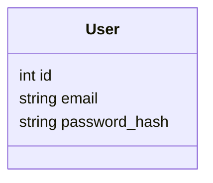

# Architecture

## Overview
This is a small, single-server web app. There is no separate frontend/backend split —
Flask serves both the web pages and handles the logic, which keeps things simple for
a one-day build.

The catalogue, balance, and orders are **not** stored locally — Flask fetches them
live from the real Day 1 furniture shop API on every page load. The only thing SQLite
holds is our own login accounts, because the shop API only has one real account for
this whole exercise, and our app wants multiple demo logins.

```
 Browser  <--HTTP-->  Flask (app.py)  <--HTTPS-->  Furniture shop API (shop_api.py)
                           |
                           <--reads/writes--> SQLite (furniture.db) — login accounts only
                           |
                           uses templates/ (HTML) + static/ (CSS)
```

1. The browser requests a page (e.g. `/`).
2. Flask (`app.py`) checks if the user is logged in (via a session cookie) using
   `db.py` (SQLite) — this part is entirely local.
3. Flask calls `shop_api.py`, which makes a real HTTPS request to the furniture
   shop API for whatever the page needs (catalogue, balance, or order history).
4. Flask fills in the relevant Jinja2 template in `templates/` with that data and
   sends the finished HTML page back to the browser.
5. When the buyer clicks "Buy", the browser POSTs to `/buy`, which calls
   `shop_api.place_order(...)` — a real order, debiting the real balance — and
   shows the result (or a friendly error) on the next page load.

## Why this stack
- **Flask** — a minimal Python web framework. It's a small, well-documented layer
  over "handle this URL, run this function, return this HTML" — easy to reason
  about without needing to understand a large framework.
- **SQLite** — used only for our own login accounts (`furniture.db`, one file, no
  server to install). Everything else is live data from the shop API, so there's
  nothing else to keep in sync.
- **`requests`** — the standard Python library for making HTTP calls; used in
  `shop_api.py` to talk to the furniture shop API.
- **Jinja2 templates** — HTML files with small `{{ variable }}` placeholders and
  `` / `` blocks. No separate frontend build step, no JavaScript
  framework — what you see in the template file is basically what renders.
- **Session cookie login** — Flask has built-in support for signed session
  cookies. Login just means: check the password, then store the user's id in
  the session. No external auth service or library needed for a demo with a
  couple of test accounts.

## The furniture shop API
Base URL: `https://day1.training.cognitivo.com.au` (hardcoded in `shop_api.py` —
it's not a secret, only the credentials below are).

| What we need | Endpoint | Notes |
|---|---|---|
| Browse the catalogue | `GET /catalogue/search-index` | Fast, no images — `item_id`, `product_name`, `category`, `price`. Deliberately **not** `/catalogue`, which also returns images and is much slower. |
| Real balance | `GET /users/{user_id}` | Returns `{user_id, name, balance}`. |
| Place a real order | `POST /orders` | Body: `{"user_id", "items": [{"item_id", "quantity"}]}`. This is also the payment — it debits the balance. |
| Order history | `GET /orders/{user_id}` | Past orders for this account. |

Auth: every request sends an `X-Api-Key` header, read from the `API_KEY` environment
variable (`.env`, gitignored — never hardcoded or committed).

**One account for everyone**: the shop API only knows about a single `user_id`
(`SHOP_USER_ID` in `.env`) for this whole training exercise. Every demo login in our
app (alice@, bob@) acts through that same account — they'll see the same balance and
order history as each other, because underneath it's the same real account.

### Error handling
`shop_api.py` turns HTTP responses into typed exceptions instead of raw status codes,
so `app.py` can catch them and show a friendly message without crashing:

```
POST /orders response       shop_api.py raises              app.py shows
200 OK                      (returns the result)            "Order placed! ..."
404 Not Found                ProductNotFoundError            "This item is no longer available."
402 Payment Required         InsufficientBalanceError         "Insufficient balance for this order."
network error / other        ShopApiError                     a clear message with the detail
```

Every route that calls `shop_api.py` wraps the call in a `try`/`except` for these
exceptions — a shop API failure never produces a raw Flask error page.

## Data model
The only thing stored locally is who can log into our app:



`User` here is just our own login gate (email + a hashed password — the password
itself is never stored). It has no budget, no products, no orders — those all live
in the shop API and are fetched live, not mirrored locally.

## Folder structure
```
MyFurnitureApp/
├── app.py            # routes: /login, /logout, / (catalogue + balance), /buy, /orders
├── shop_api.py        # HTTP client for the real furniture shop API + typed errors
├── db.py             # opens the SQLite connection; login-account queries only
├── seed_data.py       # creates the users table and inserts demo login accounts
├── requirements.txt   # flask, requests, python-dotenv
├── .env               # API_KEY, SHOP_USER_ID (gitignored, never committed)
├── .env.example       # template showing what .env needs
├── furniture.db       # the SQLite database file (generated, not edited by hand)
├── templates/
│   ├── base.html       # shared header/nav + balance display, other pages extend this
│   ├── login.html
│   ├── catalogue.html
│   └── orders.html
└── static/
    └── style.css
```

## Request flow example: buying something
1. Buyer is on `/`, which shows the live catalogue (`shop_api.get_catalogue()`) and
   their live balance (`shop_api.get_balance(...)`).
2. Buyer sets a quantity and clicks "Buy" on a product → browser POSTs `item_id` and
   `quantity` to `/buy`.
3. `app.py`'s `/buy` route calls `shop_api.place_order(...)`, which sends a real
   `POST /orders` request — this is the real payment, not a local calculation.
4. If it succeeds: flash a confirmation with the order total and the new remaining
   balance (both come straight from the API's response — no local math).
5. If it fails: flash "Insufficient balance for this order.", "This item is no
   longer available.", or a generic clear message — never a raw error page.
6. Either way, the buyer is redirected back to `/`, which re-fetches the live
   balance, so the number on screen is always the real current balance.
