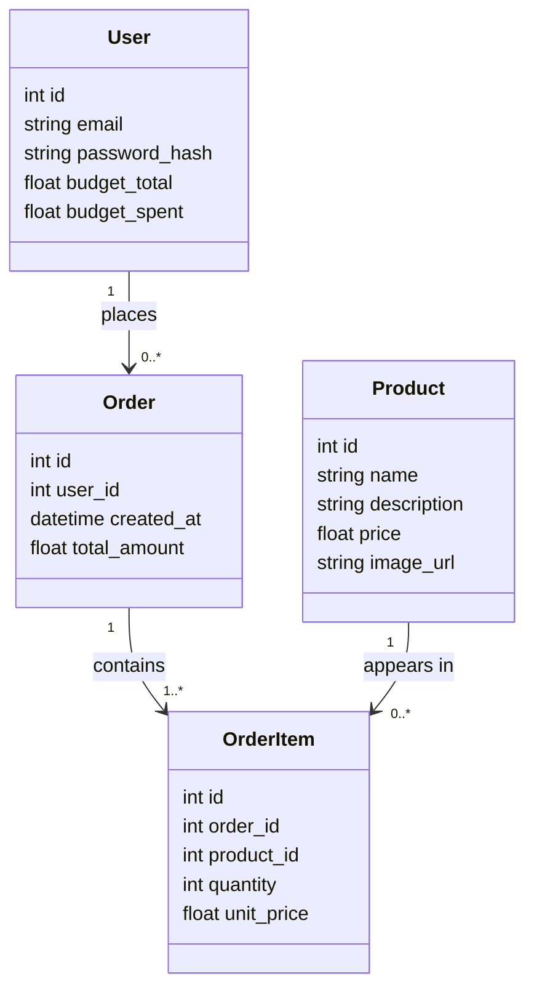

# Architecture

## Overview
This is a small, single-server web app. There is no separate frontend/backend split —
Flask serves both the web pages and handles the logic, which keeps things simple for
a one-day build.

```
 Browser  <--HTTP-->  Flask (app.py)  <--reads/writes-->  SQLite (furniture.db)
                           |
                           uses templates/ (HTML) + static/ (CSS)
```

1. The browser requests a page (e.g. `/catalogue`).
2. Flask (`app.py`) checks if the user is logged in (via a session cookie).
3. Flask asks `db.py` for the data it needs (products, budget, order history).
4. Flask fills in the relevant Jinja2 template in `templates/` with that data
   and sends the finished HTML page back to the browser.
5. When the buyer submits a form (login, add to order, confirm order), the
   browser sends that data back to Flask, which validates it, updates the
   database if valid, and re-renders the page (with an error or success message).

## Why this stack
- **Flask** — a minimal Python web framework. It's a small, well-documented layer
  over "handle this URL, run this function, return this HTML" — easy to reason
  about without needing to understand a large framework.
- **SQLite** — the whole database is one file (`furniture.db`) on disk. No server
  process to install or start, no connection string, no password. Good enough for
  a single demo user or a few judges clicking around, which is all Day 1 needs.
- **Jinja2 templates** — HTML files with small `{{ variable }}` placeholders and
  `` / `` blocks. No separate frontend build step, no JavaScript
  framework — what you see in the template file is basically what renders.
- **Session cookie login** — Flask has built-in support for signed session
  cookies. Login just means: check the password, then store the user's id in
  the session. No external auth service or library needed for a demo with a
  couple of test accounts.

## Data model
This is the shape of the four things the app needs to remember, and how they
relate to each other.



In plain English:

- **User** is a shopper's account: their login (email + password_hash — the
  password itself is never stored, only a scrambled/hashed version) plus their
  budget. `budget_total` is what they started with, `budget_spent` is a running
  total of everything they've spent so far; "remaining budget" shown on screen
  is just `budget_total - budget_spent`.
- **Product** is one item in the furniture catalogue — name, description,
  price, and a picture. Products don't know anything about users or orders;
  they're just the shelf of things available to buy.
- **Order** is a single "receipt" — one buyer, placed at one moment in time,
  with one total cost. One user can place many orders over time (that's the
  order history page), but each order belongs to exactly one user.
- **OrderItem** is a line on that receipt: "2x Oak Desk", "1x Office Chair".
  An order is made up of one or more of these. Each line points at which
  product it was, and copies that product's price into `unit_price` at the
  moment of purchase — so if a product's price changes later, past orders
  still show what the buyer actually paid, not today's price.

So the flow is: a **User** places an **Order**, and an **Order** is really
just a bundle of **OrderItems**, each of which refers back to a **Product**
from the catalogue.

Budget check on order confirmation:
```
order_total = sum(quantity * unit_price for each item in the order)
if order_total > (user.budget_total - user.budget_spent):
    reject with an error message
else:
    save the order, save its items, increase user.budget_spent by order_total
```

## Folder structure
```
MyFurnitureApp/
├── app.py            # routes: /login, /logout, /catalogue, /order, /orders
├── db.py             # opens the SQLite connection; functions like get_products(),
│                      #   get_user_by_email(), create_order(), get_orders_for_user()
├── seed_data.py       # creates the tables (if missing) and inserts demo users +
│                      #   sample furniture products
├── requirements.txt   # flask, and whatever else is needed
├── furniture.db       # the SQLite database file (generated, not edited by hand)
├── templates/
│   ├── base.html       # shared header/nav + budget display, other pages extend this
│   ├── login.html
│   ├── catalogue.html
│   └── orders.html
└── static/
    └── style.css
```

## Request flow example: placing an order
1. Buyer is on `/catalogue`, adds "Oak Desk x2" and "Office Chair x1" to their order.
2. Buyer clicks "Confirm order" → browser POSTs the cart contents to `/order`.
3. `app.py`'s `/order` route asks `db.py` for the buyer's remaining budget and
   the current price of each product, computes the total.
4. If the total fits the budget: `db.py` inserts a row into `orders` and one row
   per item into `order_items`, then updates `budget_spent` on the user.
5. If it doesn't fit: no database changes happen; the catalogue page re-renders
   with an error message showing how far over budget the order would be.
6. Either way, the buyer sees an updated "remaining budget" figure at the top
   of the page.